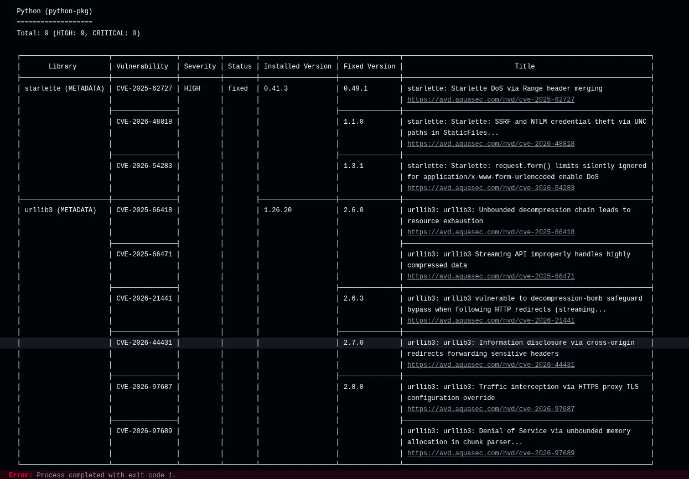
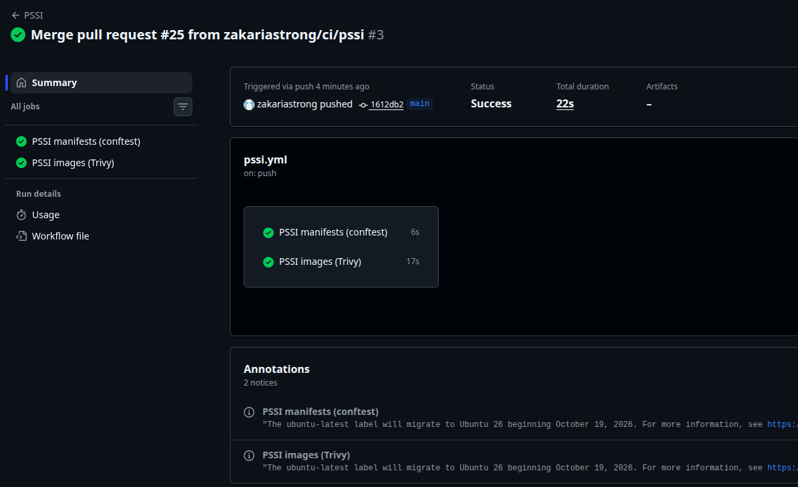
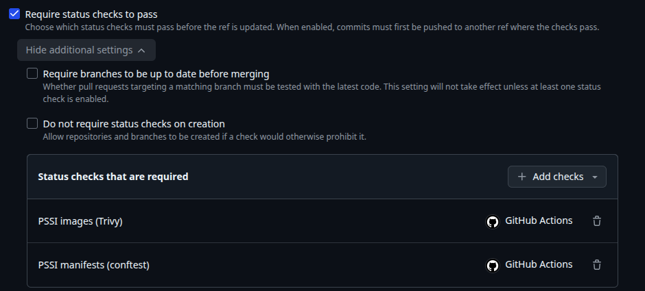
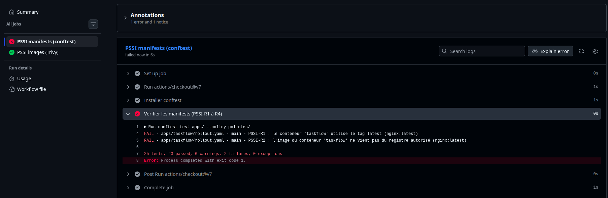

# taskflow-gitops — dépôt GitOps du cours CI/CD M2

Ce dépôt décrit **l'état voulu** de l'application TaskFlow dans Kubernetes.
Argo CD le surveille et aligne le cluster dessus : pour changer la production,
on ne tape pas de commande, on fait une **Pull Request**.

## Installation (à faire chez vous, avant le cours)

Prérequis : Docker Desktop démarré, 8 Go de RAM, 10 Go de disque libre.
Sous Windows : WSL2 (Ubuntu) + intégration WSL de Docker Desktop, et toutes les commandes dans WSL.

```bash
git clone https://github.com/9m7fjfpv9k-cyber/taskflow-gitops.git
cd taskflow-gitops
./scripts/install.sh
```

Le script crée un cluster local `kind`, installe Argo CD et Argo Rollouts,
puis télécharge les images des labs. Comptez 5 à 15 minutes.
Il peut être relancé sans risque.

## Structure

| Chemin | Rôle |
| --- | --- |
| `apps/taskflow/` | Les manifests surveillés par Argo CD |
| `argocd/application.yaml` | Déclare l'application dans Argo CD |
| `exemples/bluegreen/` | Manifests pour le déploiement Blue-Green |
| `exemples/canary/` | Manifests pour le déploiement Canary |
| `scripts/install.sh` | Installation de l'environnement |
| `scripts/argocd-ui.sh` | Ouvre l'interface d'Argo CD |
| `scripts/observe.sh` | Montre quelle version répond, et avec quel code HTTP |

## Images disponibles

`ghcr.io/9m7fjfpv9k-cyber/taskflow` en versions `1.0.0`, `1.1.0`, `2.0.0` et `2.1.0`.

## Équipe

- Zakaria (@zakariastrong)
- @Milhhhhane

## Journal des déploiements

Toute la production est changée par Pull Request. Argo CD lit le dépôt
et met le cluster à jour tout seul. Nous n'avons jamais déployé avec `kubectl`.

| Heure (merge) | Action | Version | PR | Résultat observé |
| --- | --- | --- | --- | --- |
| 10:53 | Mise en place : Argo CD pointe vers notre dépôt | 1.0.0 | #1 | 40 réponses en 1.0.0, http 200 |
| 11:41 | Déploiement de la 2.0.0 | 2.0.0 | #2 | 40 réponses en 2.0.0, http 200 |
| Entre 11:41 et 11:55 | Dérive : `kubectl scale --replicas=1` à la main | 2.0.0 | — | Argo CD remet 4 pods en 1 seconde |
| Entre 11:41 et 11:55 | Dérive : `kubectl set image` vers 1.0.0 à la main | 2.0.0 | — | Argo CD remet la 2.0.0 en 1 seconde |
| 11:55 | Retour arrière : Revert de la PR #2 | 1.0.0 | #3 | 40 réponses en 1.0.0, http 200 |
| 12:00 | Bonus : suppression de `service.yaml` | 1.0.0 | #4 | Argo CD supprime le service : 40 requêtes sans réponse (http 000) |
| 12:07 | Remise du service : Revert de la PR #4 | 1.0.0 | #5 | 40 réponses en 1.0.0, http 200 |

### Délai entre la merge et le déploiement

Pour la 2.0.0, la PR a été mergée à 11:41:08 et Argo CD a fini de déployer
à 11:41:21, soit **13 secondes**.

Ce délai change d'un déploiement à l'autre. Argo CD relit Git toutes les
60 secondes : si on merge juste après une lecture, il faut attendre la suivante.
Pour les PR #4 et #5, nous avons demandé à Argo CD de relire Git tout de suite.

La première fois, Kubernetes a aussi dû télécharger l'image 2.0.0 (16 secondes).
Les fois suivantes, l'image était déjà là et chaque pod démarrait en 6 secondes.

## Preuves

### 1. Déploiement de la 2.0.0 (PR #2)

Après la merge, Argo CD remplace les pods un par un (rolling update).
Les pods `76547969d7` sont en 1.0.0, les pods `745bdbf6f8` en 2.0.0 :

```
taskflow-745bdbf6f8-rj55d   0/1     ContainerCreating   0          0s
taskflow-76547969d7-tcg55   0/1     Completed           0          12m
taskflow-745bdbf6f8-7gp7w   1/1     Running             0          24s
```

Résultat :

```
$ ./scripts/observe.sh
     40 version=2.0.0 http=200
```

### 2. Dérive annulée par Argo CD

Nous avons modifié le cluster à la main :

```
$ kubectl -n taskflow scale deployment taskflow --replicas=1
$ kubectl -n taskflow set image deployment/taskflow taskflow=ghcr.io/9m7fjfpv9k-cyber/taskflow:1.0.0
```

Argo CD a tout remis comme dans Git, en environ 1 seconde. Les pods 1.0.0
ont été arrêtés avant même d'être prêts :

```
Scaled down replica set taskflow-76547969d7 from 2 to 0
Scaled up replica set taskflow-745bdbf6f8 from 3 to 4

$ ./scripts/observe.sh
     40 version=2.0.0 http=200
```

### 3. Retour arrière par PR (PR #3)

Avec le bouton « Revert » de GitHub. La PR est relue et approuvée comme
n'importe quel changement :


```
$ ./scripts/observe.sh
     40 version=1.0.0 http=200
```

### 4. Bonus : prune (PR #4)

Nous avons supprimé `service.yaml` dans Git. Argo CD a supprimé le service
dans le cluster, et l'application n'était plus joignable :


```
$ kubectl -n taskflow get service
No resources found in taskflow namespace.

$ ./scripts/observe.sh
     40 version=aucune http=000
```

Nous avons ensuite remis le service avec un revert (PR #5) :

```
$ ./scripts/observe.sh
     40 version=1.0.0 http=200
```

## Questions du lab

### Push ou pull ?

**Pull.** Personne ne se connecte au cluster pour déployer. Argo CD est installé
**dans** le cluster : il va lire le dépôt Git et applique lui-même les changements.
Ni les développeurs ni un pipeline n'ont besoin des clés du cluster.

### Qui a corrigé quoi ?

Nous avons modifié le cluster à la main deux fois : passer à 1 pod, puis
remettre la version 1.0.0. **Argo CD a annulé ces deux changements tout seul**,
en environ 1 seconde, car l'option `selfHeal` est activée. Il a remis ce que dit
Git : 4 pods en version 2.0.0. Une modification faite à la main ne dure pas
et ne laisse aucune trace dans Git.

De la même façon, quand nous avons supprimé `service.yaml` dans Git, Argo CD
a supprimé le service dans le cluster, car l'option `prune` est activée.

### Pourquoi git revert ?

Parce que Git est la seule source de vérité. Si on revient en arrière
directement sur le cluster, Argo CD annule ce retour, comme pour les dérives.
Avec un `git revert`, le retour en arrière passe par une PR :

- **il est tracé** : on sait qui l'a fait, quand et pourquoi ;
- **il est relu** : l'autre membre de l'équipe doit l'approuver ;
- **il est réversible** : on peut annuler le revert si besoin.

## Après-midi : stratégies de release

### Journal des déploiements de l'après-midi

Les changements de version passent toujours par une Pull Request. Les seules
commandes faites à la main sont `promote` et `abort` : elles ne changent pas
ce que dit Git, elles disent seulement à Argo Rollouts de continuer ou d'arrêter.

| Heure (merge) | Action | Version | PR | Résultat observé |
| --- | --- | --- | --- | --- |
| 14:17 | Le Deployment devient un Rollout Blue-Green | 1.0.0 | #7 | Coupure d'environ 6 secondes pendant le remplacement des pods |
| 14:24 | Nouvelle version en Blue-Green | 1.1.0 | #8 | 8 pods : `taskflow` en 1.0.0, `taskflow-preview` en 1.1.0 |
| Après 14:24 | `promote` | 1.1.0 | — | Tout le trafic passe d'un coup en 1.1.0. Les anciens pods sont supprimés 30 secondes après |
| 14:34 | Le Rollout passe en Canary | 1.1.0 | #9 | Aucun pod remplacé. Le service `taskflow-preview` est supprimé |
| 14:39 | Nouvelle version en Canary (25 %) | 2.0.0 | #10 | 10 à 16 réponses en 2.0.0 sur 40, toutes en http 200 |
| Après 14:39 | `promote` jusqu'à 100 % | 2.0.0 | — | La 2.0.0 prend le trafic par paliers, puis 40 réponses en 2.0.0 |
| 14:47 | Nouvelle version en Canary (25 %) | 2.1.0 | #11 | 3 à 4 erreurs 500 sur 40 requêtes |
| Après 14:47 | `abort` | 2.0.0 | — | 40 réponses en 2.0.0. Rollout et Argo CD en « Degraded » |
| 14:52 | Revert de la PR #11 | 2.0.0 | #12 | Rollout et Argo CD en « Healthy », sans recréer de pod |

### A. Blue-Green

La nouvelle version démarre **à côté** de l'ancienne. Les utilisateurs restent
sur l'ancienne version tant qu'on n'a pas fait `promote`.

Avant `promote`, on teste les deux services :

```
$ ./scripts/observe.sh taskflow
     40 version=1.0.0 http=200
$ ./scripts/observe.sh taskflow-preview
     40 version=1.1.0 http=200
```

Il y a 8 pods en même temps (4 en 1.0.0 et 4 en 1.1.0) : le Blue-Green demande
deux fois plus de ressources pendant le changement.

Argo CD affiche `Synced` mais `Suspended` : le cluster correspond bien à Git,
mais le déploiement attend une décision humaine. **Synced ne veut pas dire Healthy.**

Après `promote`, tout le trafic passe d'un coup sur la nouvelle version :

```
$ kubectl argo rollouts promote taskflow -n taskflow
$ ./scripts/observe.sh taskflow
     40 version=1.1.0 http=200
```

Les pods 1.0.0 restent en vie 30 secondes : pendant ce temps, on peut revenir
en arrière tout de suite.

**Ce que nous avons remarqué :** quand nous avons remplacé le Deployment par
le Rollout (PR #7), les anciens pods ont été arrêtés avant que les nouveaux
soient prêts. L'application a été coupée environ 6 secondes.

### B. Canary

La nouvelle version reçoit d'abord une petite part du trafic. Sans routeur
de trafic, 25 % veut dire 1 pod sur 4.

Au premier palier avec la 2.0.0 :

```
$ ./scripts/observe.sh
     30 version=1.1.0 http=200
     10 version=2.0.0 http=200
```

Le chiffre change à chaque essai (entre 10 et 16 sur 40), car chaque requête
va sur un pod choisi au hasard. Toutes les réponses étaient correctes : nous
avons fait `promote`, et la 2.0.0 a pris tout le trafic par paliers (50 %, puis 75 %, puis 100 %).

### La 2.1.0 : les probes étaient vertes, les utilisateurs non

Au premier palier avec la 2.1.0 :

```
$ ./scripts/observe.sh
     30 version=2.0.0 http=200
      7 version=2.1.0 http=200
      3 version=aucune http=500
```

Les erreurs 500 viennent du pod 2.1.0 : il rate environ une requête sur trois.
Pourtant :

- le pod 2.1.0 est « prêt », car il répond bien sur `/health` ;
- Argo CD affiche `Synced` et `Suspended`, sans aucune alerte.

Aucun outil n'a vu le problème. C'est en regardant les vraies réponses que
nous l'avons trouvé. Nous avons fait `abort` :

```
$ kubectl argo rollouts abort taskflow -n taskflow
$ ./scripts/observe.sh
     40 version=2.0.0 http=200
```

Tout le trafic est revenu sur la 2.0.0, mais :

| | Ce qu'il dit |
| --- | --- |
| Git | La production doit être en 2.1.0 |
| Le cluster | 4 pods en 2.0.0 |
| Le Rollout | Degraded (RolloutAborted) |
| Argo CD | Synced et Degraded |

L'`abort` est un frein d'urgence : il protège les utilisateurs, mais Git demande
toujours une version cassée. Nous avons donc fait un **revert par PR** (PR #12).
Git dit de nouveau 2.0.0, et tout est revenu en `Healthy` sans recréer de pod.

## Blue-Green ou Canary pour TaskFlow ?

**Nous choisissons le Canary.**

**Risque.** Avec la 2.1.0 en Canary, environ 10 % des requêtes ont échoué
(3 ou 4 sur 40). En Blue-Green, après `promote`, 100 % du trafic serait allé
sur la 2.1.0 : environ une requête sur trois aurait échoué. Le test sur
`taskflow-preview` n'aurait pas forcément suffi, car les probes étaient vertes.

**Coût.** Le Blue-Green a fait tourner 8 pods pendant le changement.
Le Canary n'en utilise que 4.

**Retour arrière.** Les deux sont rapides : 30 secondes de retour immédiat
pour le Blue-Green, quelques secondes avec `abort` pour le Canary.

**Limite.** Avec le Canary, deux versions répondent en même temps.
Ce n'est pas un problème pour TaskFlow, qui est une API simple. Le Blue-Green
serait meilleur si deux versions ne pouvaient pas tourner ensemble
(par exemple après un changement de la base de données).

## Question de vérification

**Pendant un canary, vous faites un abort. Que montrent le Rollout, Argo CD
et Git, et que faut-il faire ensuite ?**

Le Rollout est `Degraded` et tout le trafic revient sur l'ancienne version.
Argo CD est `Synced` (le cluster correspond à Git) mais `Degraded`.
Git demande toujours la nouvelle version. Il faut faire un **revert par PR**
pour que Git redemande l'ancienne version : tout redevient `Healthy`.

## Jour 3, matin : le pipeline décide seul

Objectif : brancher un test de charge (k6) comme porte de qualité pendant le canary.
Si la nouvelle version ne respecte pas les seuils, Argo Rollouts annule tout seul.

### Les seuils (un SLO miniature)

| Mesure | Seuil |
| --- | --- |
| Requêtes en erreur (`http_req_failed`) | moins de 2 % |
| Temps de réponse (`p95`) | moins de 250 ms |

Le test : 5 utilisateurs virtuels, 60 secondes, sur `/tasks`, via le service `taskflow-canary`
qui ne vise que les pods de la nouvelle version.

### Journal des déploiements du jour 3

| Heure (merge) | Action | Version | PR | Résultat observé |
| --- | --- | --- | --- | --- |
| ≈ 10:10 | Étalon (test à la main) | 2.0.0 | — | 740 requêtes, 0 % d'erreurs, p95 = 3,48 ms |
| 10:43 | Analyse k6 automatique ajoutée au canary | 2.0.0 | #15 | Aucun pod remplacé |
| 10:59 | Test k6 allongé à 60 secondes | 2.0.0 | #16 | Nouvel étalon : 1 480 requêtes, 0 % d'erreurs, p95 = 3,3 ms |
| 11:03 | **Déploiement de la 2.1.0** | 2.1.0 | #17 | Analyse **réussie** (0 % d'erreurs). La 2.1.0 monte à 100 % : **incident 1** |
| ≈ 11:12 | Détection humaine (`observe.sh`) | 2.1.0 | — | 16 erreurs 500 sur 40 |
| 11:18 | Revert de #17 | 2.0.0 | #18 | Analyse **échouée** (29,83 % d'erreurs) : abort, la 2.1.0 reste |
| ≈ 11:26 | `retry` + `promote --full` (urgence) | 2.0.0 | — | 40 réponses en 2.0.0, http 200. Fin de l'incident 1 |
| 11:29 | Déploiement de la 2.2.0 | 2.2.0 | #19 | Analyse réussie, montée à 100 % sans intervention |
| 11:50 | `abortOnFail` sur les seuils k6 | 2.2.0 | #20 | Le test s'arrête dès qu'un seuil est franchi |
| 11:58 | 2.1.0 redéployée exprès, pour vérifier l'analyse | 2.1.0 | #21 | Analyse **réussie** à nouveau : **incident 2** |
| 12:05 | Revert de #21 | 2.2.0 | #22 | `promote --full`, puis 40 réponses en 2.2.0. Fin de l'incident 2 |

### Ce qui s'est passé

Le lab prévoyait que l'analyse **bloque** la 2.1.0. **Chez nous, elle l'a laissée passer, deux fois.**

- La 2.1.0 renvoie 25 à 40 % d'erreurs 500. Ses probes (`/health`) sont pourtant vertes.
- Le test k6 n'a **pas mesuré** le pod 2.1.0 : le pod canary n'a reçu que 329 requêtes
  (incident 1), puis **0 requête** `GET /tasks` (incident 2), alors que k6 en a envoyé 1 480.
- Lors du retour à la 2.0.0, le test a mesuré les pods 2.1.0 cassés, a échoué,
  et l'abort automatique a **bloqué le retour arrière**.

Tous les détails, les preuves et les actions sont dans le postmortem :
**[docs/postmortem-2.1.0.md](docs/postmortem-2.1.0.md)**.

### Captures

**L'analyse du retour arrière en échec, et l'analyse de la 2.2.0 réussie**
(révision 7 : `✖ Failed` ; révision 8 : `✔ Successful`) :


**Le canary 2.2.0 promu jusqu'à 100 %, sans intervention :**


**Incident 2 : le service canary ne contient que le pod 2.1.0 (`10.244.0.114`)…**


**…et pourtant l'analyse réussit, et la 2.1.0 monte à 75 % :**


### Ce qu'on retient

- Un test de charge avec des seuils peut décider seul, **à condition de mesurer la bonne cible**.
  Il faut le vérifier (compter les requêtes reçues par le pod canary), pas le supposer.
- L'abort protège les utilisateurs ; le revert dans Git remet la vérité en place.
- Quand l'analyse bloque un retour vers une version déjà validée : `retry` puis `promote --full`,
  pour appliquer ce que Git demande.

## Jour 3, après-midi : la PSSI devient un check

Objectif : traduire une mini-PSSI en règles automatiques et **bloquantes**.
Une règle de sécurité n'existe que si un pipeline la vérifie, et une exception que si elle est datée.

### Tableau PSSI : règle → contrôle → outil → preuve

| Règle | Exigence | Contrôle automatique | Outil | Preuve |
| --- | --- | --- | --- | --- |
| R1 | Tag explicite, jamais `latest` | Check obligatoire « PSSI manifests (conftest) » sur chaque PR | conftest (`policies/kubernetes.rego`) | PR non conforme `nginx:latest` bloquée : `FAIL PSSI-R1` |
| R2 | Images du registre `ghcr.io/9m7fjfpv9k-cyber/` uniquement | Même check | conftest | Même PR bloquée : `FAIL PSSI-R2` |
| R3 | Limite de mémoire sur chaque conteneur | Même check (règle écrite par nous) | conftest | Test local d'un Deployment sans limite : `FAIL PSSI-R3` ; notre Rollout a `limits.memory: 256Mi` |
| R4 | Pods jamais en root | Même check (règle écrite par nous) | conftest | Rollout refusé avant correction (`FAIL PSSI-R4`), puis 25/25 après `runAsNonRoot: true` ; pod en prod : `uid=10001(appuser)` |
| R5 | Aucune vulnérabilité HIGH/CRITICAL corrigeable | Check obligatoire « PSSI images (Trivy) » | Trivy | 9 CVE HIGH trouvées dans la 2.2.0 (check rouge), exception datée dans `.trivyignore`, puis check vert |

Les deux checks sont **obligatoires** dans le ruleset `protection-main`, en plus de la PR approuvée par le binôme.

### Ce qu'on a fait

| Étape | PR | Résultat |
| --- | --- | --- |
| Écrire R3 et R4, ajouter `securityContext` au Rollout | feat/pssi-r3-r4 | Canary 2.2.0 non-root promu, analyse k6 réussie |
| Brancher la CI `.github/workflows/pssi.yml` | #25 | Trivy rouge (9 CVE), puis vert après exception datée |
| Rendre les checks obligatoires | Ruleset | Merge impossible si un check est rouge |
| PR non conforme `nginx:latest` | test/pr-non-conforme | conftest rouge (R1 + R2), merge bloqué ; image remise en 2.2.0, puis PR réutilisée pour ce livrable |

### L'exception R5

Trivy a trouvé 9 failles HIGH corrigeables dans les bibliothèques Python de l'image 2.2.0
(`starlette` 0.41.3 : 3 CVE ; `urllib3` 1.26.20 : 6 CVE).

On ne peut pas corriger nous-mêmes : l'image est publiée par l'équipe du cours.
L'exception est donc **écrite, justifiée, datée et validée en PR** dans `.trivyignore`,
avec une expiration au **22/10/2026** (`exp:2026-10-22`). Après cette date, le check redevient rouge tout seul.
Correctif demandé : `starlette >= 1.3.1`, `urllib3 >= 2.8.0`.

### Captures

**R5 : Trivy rouge sur l'image 2.2.0 (9 CVE HIGH corrigeables)**



**Après l'exception datée : les deux checks PSSI verts sur `main`**



**Les checks PSSI obligatoires dans le ruleset**



**La PR non conforme (`nginx:latest`) bloquée par R1 et R2**



### Qui trouve la faille de `GET /tasks/search` ?

| | La trouve ? | Quelle information ? | Quand ? | Limite ? |
| --- | --- | --- | --- | --- |
| **SAST** (Bandit, Semgrep) | Oui : le code de la route est dans le dépôt | Le fichier et la ligne exacte du code dangereux | Très tôt : à chaque PR, avant tout déploiement | Faux positifs ; ne sait pas si la faille est vraiment exploitable |
| **DAST** (OWASP ZAP) | Pas forcément : il ne voit que ce qu'il découvre en explorant l'appli | La requête qui déclenche la faille, vue de l'extérieur | Tard : l'appli doit être déployée | Ne trouve pas une route qu'aucun lien n'expose ; ne dit pas où corriger dans le code |
| **IAST** (sonde dans l'appli) | Oui : la route a un test, donc la sonde la voit s'exécuter | La requête **et** la ligne de code touchée | Pendant les tests automatiques | Aveugle sur le code qu'aucun test n'exécute |

Conclusion : aucun outil ne suffit seul. Le SAST attrape tôt, l'IAST confirme sur le code testé,
le DAST montre ce qu'un attaquant voit vraiment.

### Deux pistes d'optimisation

1. **Ne lancer le test de charge k6 que si le pod change.** Aujourd'hui, toute modification de `spec.template`
   déclenche un canary avec 60 s de test. On peut garder le test pour les changements d'image
   et d'environnement, et sauter l'analyse pour une modification de documentation ou de métadonnées.
2. **Scanner les images la nuit, pas seulement sur les PR.** Une nouvelle CVE peut sortir alors que personne n'ouvre de PR.
   Un `schedule` (cron) dans `pssi.yml` relancerait Trivy chaque nuit sur l'image en production.
   On garde le scan sur chaque PR, et on y ajoute le cache de la base Trivy pour aller plus vite.

### Ce qu'on retient

- Une règle écrite dans un document ne protège rien. Une règle dans un **check obligatoire** bloque le merge.
- Une règle qu'on n'a jamais vue échouer ne prouve rien : on l'a testée avec un fichier non conforme.
- Une exception n'est acceptable que si elle est **justifiée et datée**, et qu'elle expire toute seule.
